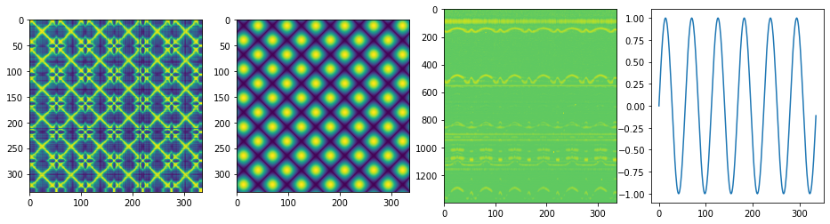

Advanced usage
===============
Instead of reading data from a folder, you can add data to the cycad object directly. You can also read out the correlation matrices and plot them separately.

Once read, raw *_*in situ* data is stored in the ``cycad.df`` attribute as a pandas dataframe. The first column is the x-axis and the subsequent columns represent individual 1-D data series. You can also add a dataframe to the cycad object directly:

.. code-block:: python
    
    import cycad as cycad
    run = cycad()
    run.df = example_dataframe

1-D electrochemical elechrochemical data is stored in the ``cycad.df_echem`` as a single-row, multi-column dataframe. You can pass a single-column dataframe to the cycad object using :meth:`cycad.cycad.read_echem_df()` method, or add it directly as a transpose of a column.

.. code-block:: python
    
    run.read_echem_df(example_dataframe)

    # or alternatively
    run.df_echem = example_dataframe.T
    
After generating the correlation matrices, you can access them directly for plotting:

.. code-block:: python
    
    fig, axes = plt.subplots(1,4, figsize=(16,4))
    axes[0].imshow(run.correlation_matrix)
    axes[1].imshow(run.correlation_matrix_ec)
    axes[2].imshow(run.df, aspect='auto', norm=LogNorm())
    axes[3].plot(run.df_echem.T)
    plt.show()

